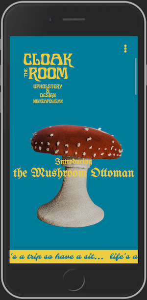

# Static Site for Cloakroom Furniture Design Studio
*Simple yet stylized online presence for new small business*

This single page website was designed for a local creative upholsterer who wanted a website to showcase their work online, but wasn't sure if a full-blown ecommerce website was right for him. The goal was to develop a fun visual style based on the logo and furniture pieces by James Blackfield, video advertisements by Janet Kolterman, and product photography by Jess Lovdahl.

Code for the animation effects based on this repo: [Codrops Organic Shape Animations](https://github.com/codrops/OrganicShapeAnimations/)

**live at [cloakroom.design](https://cloakroom.design/)**

## Technologies Used:

- HTML
- CSS
- JS
- anime.js

## Skills in Practice:

- creating animation effects in diffrent ways
- constructing JavaScript objects from HTML data attributes
- triggering events based on scroll

